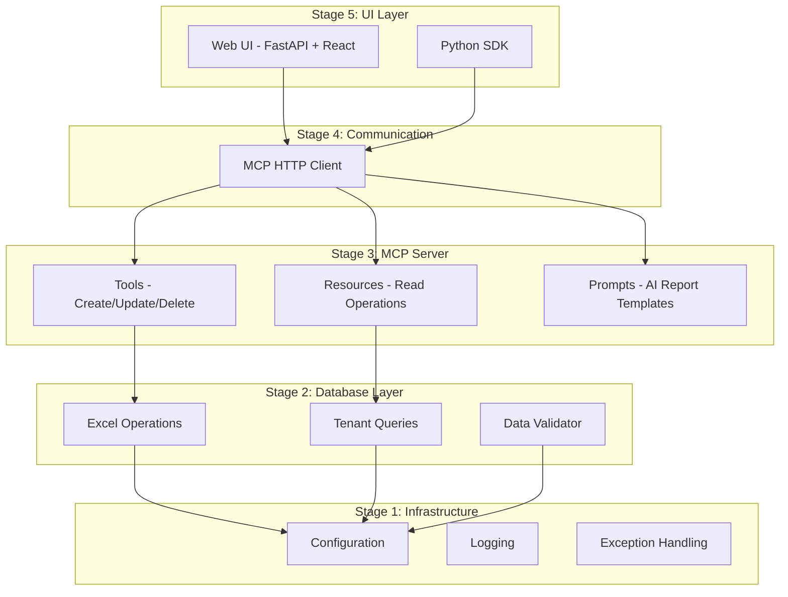

# Residential Complex Tenant Management System

A local web-based application for managing tenant information across multiple residential buildings, featuring Excel-based storage, MCP server abstraction, and AI-powered report generation.

[](https://www.python.org/downloads/)
[](https://fastapi.tiangolo.com/)
[](LICENSE)
[](tests/)
[](htmlcov/)

---

## Application Screenshot


*Dashboard showing building occupancy statistics, interactive building cards, and AI query interface*

---

## Table of Contents

- [Overview](#overview)
- [Features](#features)
- [Quick Start](#quick-start)
- [Architecture](#architecture)
- [Project Structure](#project-structure)
- [API Reference](#api-reference)
- [SDK Usage](#sdk-usage)
- [Configuration](#configuration)
- [Testing](#testing)
- [Documentation](#documentation)
- [License](#license)

---

## Overview

This system centralizes tenant management for residential complexes with 4 buildings (11, 13, 15, 17). It provides:

- **Web Dashboard**: Visual occupancy overview with interactive building cards
- **Tenant Management**: Full CRUD operations with historical data preservation
- **AI Reports**: Natural language queries via OpenAI GPT integration
- **MCP Protocol**: Model Context Protocol server for structured data access

**Target Users**: Building managers and property administrators

**Key Benefit**: Reduces manual tenant data management from 5-10 hours/week to under 1 hour

---

## Features

| Feature | Description |
|---------|-------------|
| Multi-Building Support | Buildings 11, 13, 15, 17 with 35-40 apartments each |
| Tenant Registration | Owner/renter tracking, move-in/out dates, parking, storage |
| Family Members | WhatsApp group and PalGate access tracking |
| Historical Data | Complete tenant history preserved (never overwritten) |
| AI Reports | Natural language queries generate Markdown reports |
| Excel Database | Simple XLSX storage with automatic backups |
| REST API | FastAPI-based MCP server with OpenAPI documentation |
| Python SDK | High-level client for programmatic access |

---

## Quick Start

### Prerequisites

- Python 3.10+
- pip

### Installation

```bash
# Clone repository
git clone https://github.com/yourusername/tenant-management.git
cd tenant-management

# Create virtual environment
python3 -m venv .venv
source .venv/bin/activate  # Linux/Mac
# .venv\Scripts\activate   # Windows

# Install dependencies
pip install -r requirements.txt
pip install -e .

# Copy environment config
cp .env.example .env

# Create data directories
mkdir -p data/excel data/backups logs
```

### Start the Server

```bash
# Start MCP server (port 8000)
uvicorn src.mcp_server.server:app --reload

# Start Web UI server (port 8080)
uvicorn src.web_ui.backend:web_app --port 8080
```

### Access the Application

- **Web UI**: http://localhost:8080
- **API Docs**: http://localhost:8000/docs
- **Health Check**: http://localhost:8000/

---

## Architecture

The system follows a 5-stage MCP (Model Context Protocol) architecture:



### Component Overview

| Stage | Package | Purpose |
|-------|---------|---------|
| 1 | `src/config`, `src/logging_config`, `src/exceptions` | Configuration, logging, error handling |
| 2 | `src/database` | Excel operations, queries, validation |
| 3 | `src/mcp_server` | FastAPI REST API (tools, resources, prompts) |
| 4 | `src/communication` | HTTP client for MCP protocol |
| 5 | `src/sdk`, `src/web_ui`, `src/ai_agent` | High-level SDK, web interface, AI reports |

---

## Project Structure

```
tenant-management/
├── src/
│   ├── config/              # Configuration loading (YAML + .env)
│   ├── logging_config/      # Structured logging setup
│   ├── exceptions/          # Custom exception hierarchy
│   ├── database/            # Excel database operations
│   │   ├── models.py        # Pydantic data models
│   │   ├── excel_manager.py # Low-level Excel I/O
│   │   ├── excel_operations.py # Business operations
│   │   ├── queries.py       # Query functions
│   │   └── validators.py    # Data validation
│   ├── mcp_server/          # MCP REST API
│   │   ├── server.py        # FastAPI application
│   │   ├── tools.py         # Write operations (create, update, delete)
│   │   ├── resources.py     # Read operations (get, list)
│   │   └── prompts.py       # AI prompt templates
│   ├── communication/       # MCP client
│   │   └── http_client.py   # HTTP client implementation
│   ├── sdk/                 # High-level SDK
│   │   └── client.py        # TenantSDK class
│   ├── ai_agent/            # AI report generation
│   │   ├── reporter.py      # LLM integration
│   │   └── pdf_generator.py # PDF export
│   └── web_ui/              # Web interface
│       ├── backend.py       # FastAPI app for UI
│       ├── routes.py        # API routes for UI
│       └── static/          # React app (compiled)
├── tests/                   # Test suite (174 tests)
├── docs/                    # Documentation
├── config.yaml              # Application configuration
├── .env.example             # Environment template
├── requirements.txt         # Production dependencies
├── requirements-dev.txt     # Development dependencies
└── pyproject.toml           # Package configuration
```

---

## API Reference

### MCP Server Endpoints

**Base URL**: `http://localhost:8000`

#### Tools (State-Changing Operations)

| Method | Endpoint | Description |
|--------|----------|-------------|
| POST | `/tools/invoke` | Invoke a tool (create_tenant, update_tenant, end_tenancy, get_tenant) |
| GET | `/tools` | List available tools |

#### Resources (Read Operations)

| Method | Endpoint | Description |
|--------|----------|-------------|
| GET | `/resources/buildings` | Get all buildings |
| GET | `/resources/buildings/{number}` | Get building details with occupancy |
| GET | `/resources/tenants` | Get all tenants (optional: `?building=11`) |
| GET | `/resources/tenants/{building}/{apartment}/history` | Get tenant history |
| GET | `/resources/occupancy` | Get occupancy statistics |
| GET | `/resources/whatsapp` | Get WhatsApp contacts |
| GET | `/resources/parking` | Get parking authorizations |

#### Prompts (AI Report Templates)

| Method | Endpoint | Description |
|--------|----------|-------------|
| GET | `/prompts` | List available prompts |
| POST | `/prompts/generate` | Generate AI prompt for report |

### Example API Calls

```bash
# Get all buildings
curl http://localhost:8000/resources/buildings

# Get tenants in building 11
curl "http://localhost:8000/resources/tenants?building=11"

# Create a tenant
curl -X POST http://localhost:8000/tools/invoke \
  -H "Content-Type: application/json" \
  -d '{
    "name": "create_tenant",
    "arguments": {
      "building_number": 11,
      "apartment_number": 101,
      "first_name": "John",
      "last_name": "Smith",
      "phone": "054-1234567",
      "is_owner": true
    }
  }'

# Generate AI report prompt
curl -X POST http://localhost:8000/prompts/generate \
  -H "Content-Type: application/json" \
  -d '{
    "name": "occupancy_report",
    "arguments": {"building": 11}
  }'
```

---

## SDK Usage

### Python SDK

```python
from src.sdk import TenantSDK

# Initialize SDK
sdk = TenantSDK(base_url="http://localhost:8000")

# Create a tenant
result = sdk.create_tenant(
    building=11,
    apartment=101,
    first_name="John",
    last_name="Smith",
    phone="054-1234567",
    is_owner=True
)

# Get tenant info
tenant = sdk.get_tenant(building=11, apartment=101)
print(f"Tenant: {tenant.full_name}")

# Get building occupancy
building = sdk.get_building_occupancy(11)
print(f"Occupancy: {building.occupancy_rate}%")

# Get all tenants
tenants = sdk.get_all_tenants(building=11)
for t in tenants:
    print(f"  - Apt {t['apartment_number']}: {t['first_name']} {t['last_name']}")

# Close connection
sdk.close()
```

### AI Report Agent

```python
from src.ai_agent import ReportAgent

with ReportAgent() as agent:
    # Generate occupancy report
    report = agent.generate_occupancy_report(building=11)
    print(report.content)

    # Custom natural language query
    report = agent.process_custom_query("How many vacant apartments in building 15?")
    print(report.content)
```

---

## Configuration

### Environment Variables (`.env`)

```bash
# Database
EXCEL_DATABASE_PATH=./data/excel/tenants.xlsx

# MCP Server
MCP_SERVER_HOST=localhost
MCP_SERVER_PORT=8000

# Web UI
WEB_UI_PORT=8080

# AI (Optional - for report generation)
OPENAI_API_KEY=sk-your-key-here
AI_MODEL_NAME=gpt-4o
```

### Application Config (`config.yaml`)

```yaml
buildings:
  - number: 11
    total_apartments: 40
  - number: 13
    total_apartments: 35
  - number: 15
    total_apartments: 40
  - number: 17
    total_apartments: 35

database:
  backup_enabled: true
  backup_interval_hours: 24

validation:
  phone_pattern: "^05[0-9]-[0-9]{7}$"
  name_pattern: "^[A-Za-z\\s\\-']+$"
```

---

## Testing

```bash
# Run all tests
pytest tests/ -v

# Run with coverage
pytest tests/ --cov=src --cov-report=html

# Run specific test file
pytest tests/test_database.py -v

# Run specific test
pytest tests/test_sdk.py::test_create_tenant -v
```

**Current Status**: 174 tests passing, 81.81% coverage

---

## Documentation

| Document | Description |
|----------|-------------|
| [Architecture.md](docs/Architecture.md) | System architecture and design decisions |
| [PRD.md](docs/PRD.md) | Product requirements document |
| [CONFIG.md](docs/CONFIG.md) | Configuration reference |
| [EXAMPLE.md](docs/EXAMPLE.md) | Comprehensive usage examples |
| [PROMPT_BOOK.md](docs/PROMPT_BOOK.md) | AI prompt templates |
| [EXTENSIBILITY.md](docs/EXTENSIBILITY.md) | Extension guide |
| [COSTS.md](docs/COSTS.md) | Cost analysis |
| [CONTRIBUTING.md](docs/CONTRIBUTING.md) | Contribution guidelines |

---

## License

This project is licensed under the MIT License - see [LICENSE](LICENSE) for details.

---

## Version History

| Version | Date | Changes |
|---------|------|---------|
| 1.1.0 | 2026-01-11 | Enhanced UI, family members, AI reports, comprehensive documentation |
| 1.0.0 | 2026-01-10 | Initial release with core features |

---

**Built with**: Python 3.10+ | FastAPI | openpyxl | OpenAI | Pydantic
