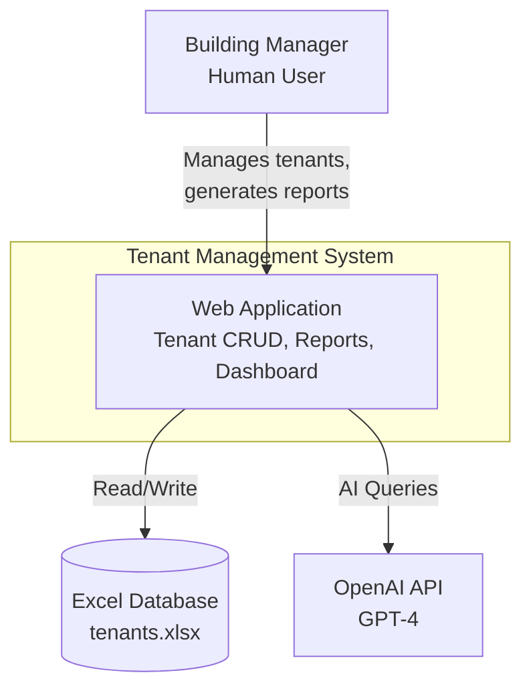
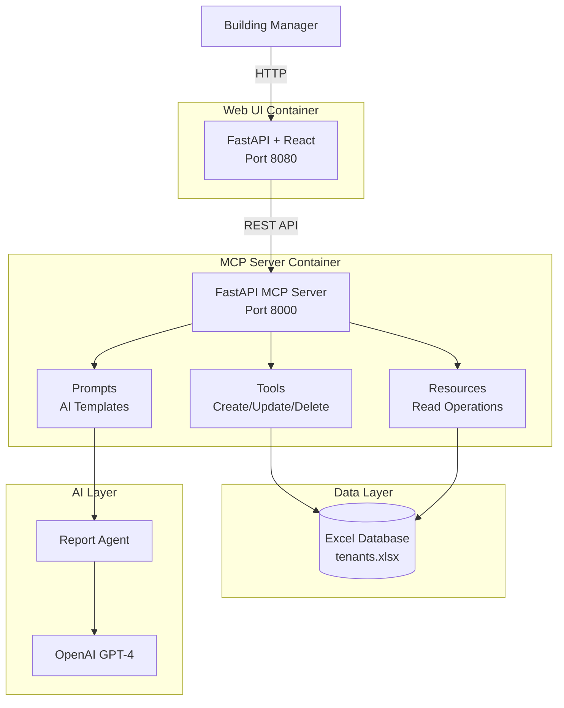
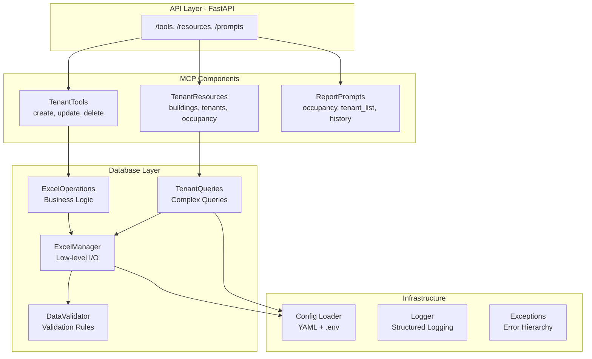
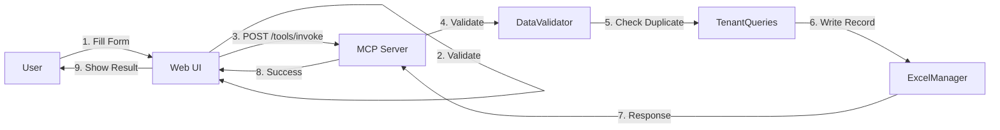
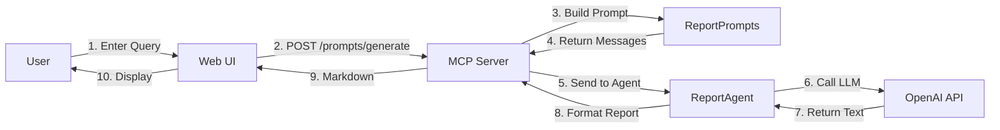
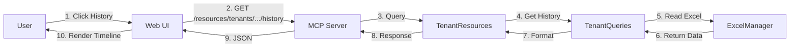

# Architecture Documentation
# Residential Complex Tenant Management System

**Version**: 1.0
**Date**: 2026-01-10

---

## Table of Contents

1. [System Overview](#system-overview)
2. [C4 Architecture Model](#c4-architecture-model)
3. [5-Stage MCP Development Architecture](#5-stage-mcp-development-architecture)
4. [Data Model](#data-model)
5. [API Contracts](#api-contracts)
6. [Key Flows](#key-flows)
7. [Deployment Architecture](#deployment-architecture)
8. [Technology Stack](#technology-stack)
9. [Security Architecture](#security-architecture)
10. [Quality Attributes](#quality-attributes)

---

## System Overview

The Residential Complex Tenant Management System is a local, web-based application that manages tenant information across multiple buildings using an Excel database, MCP server abstraction layer, React web interface, and AI-powered report generation.

**Core Principles**:
- **Modularity**: 5-stage MCP architecture enabling parallel development
- **Simplicity**: Excel database for easy data access and backup
- **Separation of Concerns**: Clear boundaries between data, business logic, and presentation
- **No Hardcoded Values**: All configuration externalized
- **Maintainability**: Max 150 lines per file

---

## C4 Architecture Model

### Level 1: System Context



**External Dependencies**:
- **Excel Database**: Local XLSX file storing tenant data
- **AI Model API**: Anthropic Claude for report generation

### Level 2: Container Diagram



### Level 3: Component Diagram (MCP Server)



---

## 5-Stage MCP Development Architecture

This project uses a **5-stage architecture** with Git worktrees to enable parallel development.

### Stage 1: Infrastructure

**Purpose**: Foundation and project setup

**Components**:
- Project structure and scaffolding
- Configuration management (config.yaml, .env)
- Logging infrastructure
- Exception handling framework
- Git workflow setup

**Git Worktree**: `worktrees/01-infrastructure`

**Deliverables**:
- Repository structure
- Configuration files
- Base utilities
- Development documentation

### Stage 2: Basic Tools

**Purpose**: Core utilities and Excel operations

**Components**:
- Excel database schema design
- Excel read/write utilities (openpyxl)
- Data validation modules
- Backup/restore utilities
- Unit tests for utilities

**Git Worktree**: `worktrees/02-basic-tools`

**Key Modules**:
- `src/database/excel_client.py`: Excel database client
- `src/database/schema.py`: Database schema definition
- `src/database/validators.py`: Data validation logic
- `src/database/backup.py`: Backup/restore utilities

**Deliverables**:
- Working Excel database layer
- Data validation framework
- Backup/restore functionality
- Comprehensive unit tests

### Stage 3: Full MCP Server

**Purpose**: Business logic and API layer

**Components**:
- Service layer (tenant, building, history services)
- REST API endpoints (FastAPI/Flask)
- API documentation (OpenAPI/Swagger)
- Integration with Basic Tools layer
- Integration tests

**Git Worktree**: `worktrees/03-full-mcp`

**Key Modules**:
- `src/mcp_server/api/`: API route definitions
- `src/mcp_server/services/`: Business logic services
- `src/mcp_server/models/`: API request/response models
- `src/mcp_server/main.py`: Server entry point

**API Endpoints**:
- `POST /api/tenants`: Create tenant
- `GET /api/tenants/{id}`: Get tenant details
- `PUT /api/tenants/{id}`: Update tenant
- `GET /api/buildings/{number}/tenants`: List building tenants
- `GET /api/tenants/{id}/history`: Get tenant history
- `POST /api/reports/query`: Generate AI report

**Deliverables**:
- Complete MCP server implementation
- RESTful API with documentation
- Service layer with business logic
- Integration tests

### Stage 4: Communication Layer

**Purpose**: Frontend-backend communication and client SDK

**Components**:
- JavaScript/TypeScript API client library
- Request/response serialization
- Error handling and retry logic
- API integration tests
- End-to-end test framework

**Git Worktree**: `worktrees/04-communication`

**Key Modules**:
- `src/web_ui/api/client.js`: API client library
- `src/web_ui/api/tenants.js`: Tenant API methods
- `src/web_ui/api/reports.js`: Report API methods
- `src/web_ui/utils/error-handler.js`: Error handling

**Deliverables**:
- API client library for React
- Communication layer tests
- Error handling framework
- E2E test suite

### Stage 5: SDK/UI Layer

**Purpose**: User interface and user experience

**Components**:
- React application structure
- UI components (forms, tables, dashboards)
- State management (React Context/Redux)
- Routing and navigation
- AI report interface
- User acceptance tests

**Git Worktree**: `worktrees/05-sdk-ui`

**Key Components**:
- `src/web_ui/components/`: Reusable UI components
- `src/web_ui/pages/`: Page-level components
- `src/web_ui/hooks/`: Custom React hooks
- `src/web_ui/context/`: State management contexts
- `src/web_ui/App.js`: Main application component

**Pages**:
- Dashboard: Occupancy overview, quick stats
- Tenants: List, search, filter tenants
- Tenant Detail: View/edit tenant information
- Building View: Building-specific tenant list
- Reports: AI query interface and report viewer
- History: Tenant history timeline

**Deliverables**:
- Complete React application
- All UI components implemented
- User acceptance tests
- Production build

### Worktree Integration Strategy

**Branch Strategy**:
```
main
  ├── 01-infrastructure (worktree)
  ├── 02-basic-tools (worktree, depends on 01)
  ├── 03-full-mcp (worktree, depends on 02)
  ├── 04-communication (worktree, depends on 03)
  └── 05-sdk-ui (worktree, depends on 04)
```

**Integration Process**:
1. Each stage developed independently in its worktree
2. Integration tests run before merging
3. Merge stages sequentially: 01 → 02 → 03 → 04 → 05 → main
4. Conflicts resolved during merge
5. Full regression tests after each merge

---

## Data Model

### Excel Workbook Structure

**File**: `data/excel/tenants.xlsx`

#### Sheet 1: Buildings

| Column | Type | Description | Example |
|--------|------|-------------|---------|
| building_number | Integer | Building identifier | 11 |
| total_apartments | Integer | Total apartment count | 40 |
| address | String | Building address | "123 Main St" |

#### Sheet 2: Tenants

| Column | Type | Description | Example |
|--------|------|-------------|---------|
| tenant_id | Integer | Unique tenant ID | 1001 |
| building | Integer | Building number | 11 |
| apartment | Integer | Apartment number | 101 |
| owner_name | String | Legal owner | "John Doe" |
| tenant_name | String | Current tenant | "Jane Smith" |
| move_in_date | Date | Move-in date | 2024-01-15 |
| move_out_date | Date | Move-out date (null if current) | null |
| parking_access | Boolean | Parking authorized | TRUE |
| whatsapp_group | Boolean | In WhatsApp group | TRUE |
| is_current | Boolean | Currently occupied | TRUE |

#### Sheet 3: History

| Column | Type | Description | Example |
|--------|------|-------------|---------|
| history_id | Integer | Unique history record ID | 5001 |
| building | Integer | Building number | 11 |
| apartment | Integer | Apartment number | 101 |
| tenant_name | String | Previous tenant | "Bob Johnson" |
| move_in_date | Date | Move-in date | 2022-06-01 |
| move_out_date | Date | Move-out date | 2023-12-31 |
| parking_access | Boolean | Had parking | FALSE |
| notes | String | Additional notes | "Transferred to Building 13" |

### Data Validation Rules

1. **Building Number**: Must be one of [11, 13, 15, 17]
2. **Apartment Number**: Must be within building capacity
3. **Move-in Date**: Cannot be in future
4. **Move-out Date**: Must be after move-in date
5. **Tenant Name**: Required, non-empty string
6. **Unique Constraint**: (building, apartment, is_current=TRUE) must be unique

---

## API Contracts

### Base URL
```
http://localhost:8000/api
```

### Authentication
**v1.0**: No authentication (single-user local deployment)
**Future**: JWT-based authentication

### Common Response Format
```json
{
  "success": true,
  "data": { ... },
  "error": null,
  "timestamp": "2024-01-15T10:30:00Z"
}
```

### Tenant API

#### Create Tenant
```http
POST /api/tenants
Content-Type: application/json

{
  "building": 11,
  "apartment": 101,
  "owner_name": "John Doe",
  "tenant_name": "Jane Smith",
  "move_in_date": "2024-01-15",
  "parking_access": true,
  "whatsapp_group": false
}

Response: 201 Created
{
  "success": true,
  "data": {
    "tenant_id": 1001,
    "building": 11,
    "apartment": 101,
    ...
  }
}
```

#### Get Tenant
```http
GET /api/tenants/{tenant_id}

Response: 200 OK
{
  "success": true,
  "data": {
    "tenant_id": 1001,
    "building": 11,
    "apartment": 101,
    "owner_name": "John Doe",
    "tenant_name": "Jane Smith",
    "move_in_date": "2024-01-15",
    "parking_access": true,
    "whatsapp_group": false,
    "is_current": true
  }
}
```

#### Update Tenant
```http
PUT /api/tenants/{tenant_id}
Content-Type: application/json

{
  "parking_access": true,
  "whatsapp_group": true
}

Response: 200 OK
```

#### Move Out Tenant
```http
POST /api/tenants/{tenant_id}/moveout
Content-Type: application/json

{
  "move_out_date": "2024-12-31"
}

Response: 200 OK
```

### Building API

#### List Building Tenants
```http
GET /api/buildings/{building_number}/tenants?current_only=true

Response: 200 OK
{
  "success": true,
  "data": {
    "building": 11,
    "total_apartments": 40,
    "occupied": 35,
    "vacant": 5,
    "tenants": [...]
  }
}
```

### Report API

#### Generate AI Report
```http
POST /api/reports/query
Content-Type: application/json

{
  "query": "Show me all tenants who moved in during 2024",
  "format": "markdown"
}

Response: 200 OK
{
  "success": true,
  "data": {
    "report_id": "rpt_001",
    "query": "Show me all tenants who moved in during 2024",
    "markdown": "# Tenants who moved in during 2024\n\n...",
    "pdf_url": "/reports/rpt_001.pdf"
  }
}
```

### Search API

#### Search Tenants
```http
GET /api/search/tenants?q=jane&building=11&parking=true

Response: 200 OK
{
  "success": true,
  "data": {
    "results": [...],
    "count": 3,
    "query": "jane"
  }
}
```

---

## Key Flows

### Flow 1: New Tenant Registration



### Flow 2: Generate AI Report



### Flow 3: View Tenant History



---

## Deployment Architecture

### Local Deployment (v1.0)

```
┌────────────────────────────────────────────┐
│         Local Machine                       │
│                                              │
│  ┌──────────────────────────────────────┐  │
│  │  MCP Server (Python)                 │  │
│  │  Port: 8000                           │  │
│  │  Process: python -m src.mcp_server   │  │
│  └──────────────────────────────────────┘  │
│                                              │
│  ┌──────────────────────────────────────┐  │
│  │  React Dev Server (Node.js)          │  │
│  │  Port: 3000                           │  │
│  │  Process: npm start                   │  │
│  └──────────────────────────────────────┘  │
│                                              │
│  ┌──────────────────────────────────────┐  │
│  │  File System                          │  │
│  │                                        │  │
│  │  /data/excel/tenants.xlsx            │  │
│  │  /data/backups/                       │  │
│  │  /logs/app.log                        │  │
│  │  /reports/*.pdf                       │  │
│  └──────────────────────────────────────┘  │
│                                              │
└────────────────────────────────────────────┘
```

### Production Deployment (Future)

- MCP Server: Containerized (Docker)
- React UI: Static build served by Nginx
- Excel Database: Replaced with PostgreSQL
- Backups: Automated to cloud storage
- HTTPS: Enabled with Let's Encrypt
- Monitoring: Prometheus + Grafana

---

## Technology Stack

### Backend
- **Language**: Python 3.10+
- **Web Framework**: FastAPI (or Flask)
- **Excel Library**: openpyxl
- **AI Integration**: Anthropic SDK
- **Testing**: pytest, pytest-cov
- **Linting**: pylint, ruff, black, isort

### Frontend
- **Framework**: React 18+
- **Language**: JavaScript (TypeScript future)
- **Build Tool**: Create React App (or Vite)
- **Styling**: CSS Modules (or Tailwind CSS)
- **State**: React Context API
- **Testing**: Jest, React Testing Library

### Development Tools
- **Version Control**: Git with worktrees
- **Package Management**: pip, npm
- **CI/CD**: GitHub Actions
- **Documentation**: Markdown, Swagger/OpenAPI

---

## Security Architecture

### Threat Model

1. **Unauthorized Access**: Mitigated by future authentication layer
2. **Data Tampering**: Excel file permissions (OS-level)
3. **Secrets Exposure**: Environment variables, .gitignore
4. **API Abuse**: Rate limiting (future)
5. **XSS**: React auto-escaping
6. **CSRF**: CSRF tokens (future with authentication)

### Security Controls

- **Configuration**: No secrets in code, all in .env
- **Input Validation**: Server-side validation on all inputs
- **File Permissions**: Excel file read/write only by app user
- **Backup Encryption**: Future enhancement
- **HTTPS**: Required for production deployment

---

## Quality Attributes

### Performance
- **Response Time**: < 2 seconds for queries
- **Report Generation**: < 10 seconds for AI reports
- **Concurrent Users**: Support 10 simultaneous users

### Scalability
- **Data Volume**: Support 500+ tenant records
- **Building Expansion**: Easy to add new buildings

### Maintainability
- **Code Quality**: Pylint 10/10, 80%+ test coverage
- **File Size**: Max 150 lines per file
- **Documentation**: Inline comments, ADRs for key decisions

### Reliability
- **Uptime**: 99%+ during business hours
- **Data Integrity**: Automated daily backups
- **Error Handling**: Graceful degradation, user-friendly messages

---

## Architecture Decision Records

See `docs/ADRs/` directory for detailed ADRs:
- `ADR-001-excel-database.md`: Why Excel over SQL
- `ADR-002-5-stage-mcp.md`: 5-stage MCP architecture rationale
- `ADR-003-git-worktrees.md`: Parallel development with worktrees
- `ADR-004-react-frontend.md`: React vs. other frontend frameworks

---

**Document Control**

| Version | Date | Author | Changes |
|---------|------|--------|---------|
| 1.0 | 2026-01-10 | System | Initial architecture documentation |
