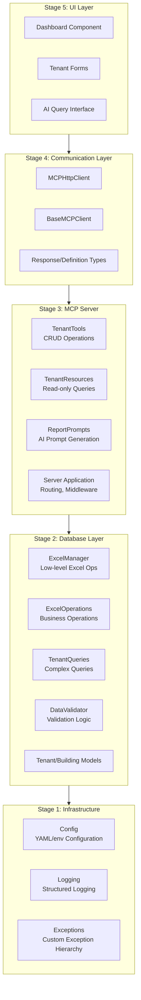
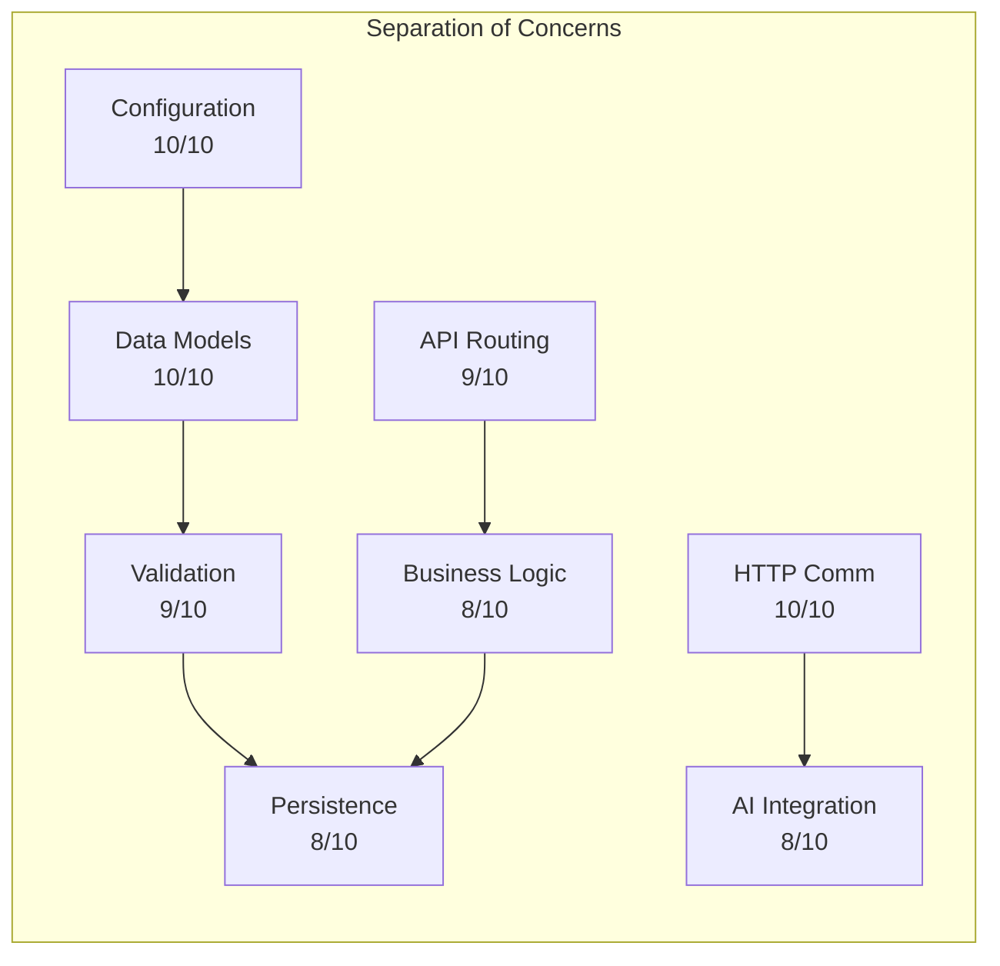
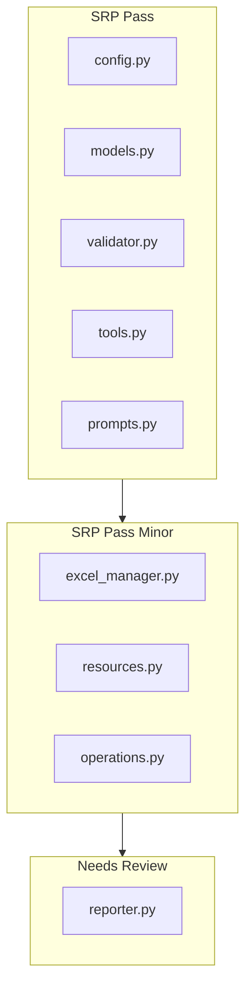
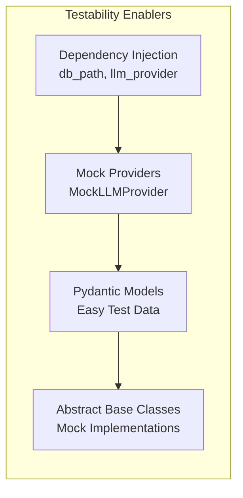
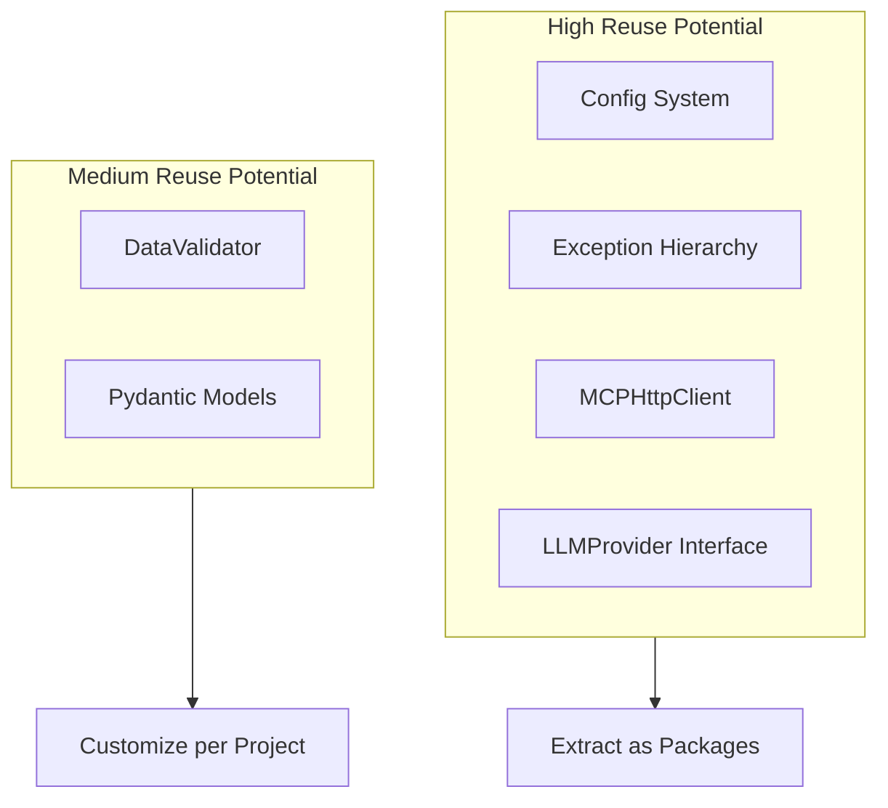

# Building Blocks Review

This document provides an architectural review of the Tenant Management System following building-block principles: separation of concerns, single responsibility, testability, and reusability.

---

## Table of Contents

- [Architecture Overview](#architecture-overview)
- [Module Analysis](#module-analysis)
- [Separation of Concerns](#separation-of-concerns)
- [Single Responsibility Principle](#single-responsibility-principle)
- [Testability Assessment](#testability-assessment)
- [Reusability Evaluation](#reusability-evaluation)
- [Prioritized Recommendations](#prioritized-recommendations)

---

## Architecture Overview

The system follows a 5-stage MCP (Model Context Protocol) architecture:

---

## Module Analysis

### Stage 1: Infrastructure (`src/config/`, `src/logging/`, `src/exceptions/`)

| Module | Files | Lines | Responsibility | Rating |
|--------|-------|-------|----------------|--------|
| config | 2 | ~150 | Configuration loading | Excellent |
| logging | 2 | ~100 | Structured logging | Good |
| exceptions | 1 | ~80 | Exception hierarchy | Excellent |

**Strengths:**
- Clean separation of configuration from business logic
- Hierarchical exception types enable specific error handling
- Configuration supports multiple sources (YAML, env)

**Improvements:**
- Consider adding configuration validation at startup

### Stage 2: Database (`src/database/`)

| Module | Files | Lines | Responsibility | Rating |
|--------|-------|-------|----------------|--------|
| models | 1 | ~200 | Data models (Pydantic) | Excellent |
| excel_manager | 1 | ~180 | Low-level Excel I/O | Good |
| operations | 1 | ~150 | Business operations | Good |
| queries | 1 | ~200 | Complex queries | Good |
| validator | 1 | ~120 | Data validation | Excellent |

**Strengths:**
- Clear model definitions with Pydantic
- Separation between low-level I/O and business operations
- Centralized validation logic

**Improvements:**
- ExcelManager could benefit from connection pooling abstraction
- Queries module has some code duplication for filtering

### Stage 3: MCP Server (`src/mcp_server/`)

| Module | Files | Lines | Responsibility | Rating |
|--------|-------|-------|----------------|--------|
| server | 1 | ~160 | FastAPI application | Excellent |
| tools | 1 | ~160 | State-changing operations | Good |
| resources | 1 | ~180 | Read-only operations | Good |
| prompts | 1 | ~120 | AI prompt generation | Excellent |
| prompt_templates | 1 | ~60 | Template strings | Excellent |

**Strengths:**
- Clean separation of Tools (write) vs Resources (read)
- Prompt templates isolated for easy modification
- CORS and middleware properly configured

**Improvements:**
- Server module handles too many routes inline; consider route separation

### Stage 4: Communication (`src/communication/`)

| Module | Files | Lines | Responsibility | Rating |
|--------|-------|-------|----------------|--------|
| base | 1 | ~80 | Abstract client interface | Excellent |
| http_client | 1 | ~130 | HTTP implementation | Good |

**Strengths:**
- Abstract base class enables multiple transport implementations
- Error handling with custom exceptions
- Session management with context managers

**Improvements:**
- Could add retry logic for transient failures
- Consider async client implementation

### Stage 5: AI Agent (`src/ai_agent/`)

| Module | Files | Lines | Responsibility | Rating |
|--------|-------|-------|----------------|--------|
| reporter | 1 | ~160 | Report generation | Good |
| pdf_generator | 1 | ~100 | PDF export | Good |

**Strengths:**
- LLM provider abstraction (MockLLMProvider, OpenAIProvider)
- Context manager support for resource cleanup

**Improvements:**
- Reporter does both orchestration and formatting; consider splitting
- PDF generator could use template system

---

## Separation of Concerns

### Assessment Matrix

| Concern | Primary Module | Secondary Modules | Leakage | Score |
|---------|---------------|-------------------|---------|-------|
| Configuration | src/config | None | None | 10/10 |
| Data Models | src/database/models | None | None | 10/10 |
| Persistence | src/database/excel_manager | operations | Minor | 8/10 |
| Validation | src/database/validator | models (Pydantic) | None | 9/10 |
| API Routing | src/mcp_server/server | None | None | 9/10 |
| Business Logic | src/mcp_server/tools | database/operations | Acceptable | 8/10 |
| AI Integration | src/ai_agent/reporter | communication | Acceptable | 8/10 |
| HTTP Communication | src/communication | None | None | 10/10 |

**Overall Score: 9.0/10**

### Concern Flow Diagram

### Identified Leakages

1. **Minor**: `excel_manager` knows about business concepts (tenant structure)
   - **Recommendation**: Extract schema definition to models module

2. **Acceptable**: Tools module imports database operations directly
   - **Note**: This is intentional coupling within the same architectural layer

---

## Single Responsibility Principle

### Module Compliance

| Module | Primary Responsibility | Secondary Responsibilities | SRP Compliance |
|--------|----------------------|---------------------------|----------------|
| config/config.py | Load configuration | Environment variable handling | Pass |
| database/models.py | Define data structures | None | Pass |
| database/excel_manager.py | Excel file I/O | Cell formatting | Pass (minor) |
| database/operations.py | CRUD operations | History management | Pass |
| database/queries.py | Data queries | Data filtering | Pass |
| database/validator.py | Data validation | Pattern matching | Pass |
| mcp_server/server.py | HTTP routing | Error handling | Pass |
| mcp_server/tools.py | Write operations | None | Pass |
| mcp_server/resources.py | Read operations | Data transformation | Pass (minor) |
| mcp_server/prompts.py | Prompt generation | None | Pass |
| communication/http_client.py | HTTP communication | Session management | Pass |
| ai_agent/reporter.py | Report orchestration | LLM provider selection | Review |

### SRP Compliance Flow

### Recommendations

1. **reporter.py**: Consider extracting LLM provider factory to separate module
2. **resources.py**: Minor data transformation could move to service layer

---

## Testability Assessment

### Test Coverage Analysis

| Module | Unit Tests | Integration Tests | Coverage | Testability |
|--------|------------|-------------------|----------|-------------|
| config | Yes | N/A | High | Excellent |
| database/models | Yes | N/A | High | Excellent |
| database/excel_manager | Yes | Yes | Medium | Good |
| database/operations | Yes | Yes | High | Good |
| database/queries | Yes | Yes | High | Good |
| database/validator | Yes | N/A | High | Excellent |
| mcp_server/server | Yes | Yes | High | Good |
| mcp_server/tools | Yes | Yes | High | Good |
| mcp_server/resources | Yes | Yes | High | Good |
| communication | Yes | Yes | Medium | Good |
| ai_agent | Yes | Yes | Medium | Good |

### Testability Enablers

1. **Dependency Injection**: Used throughout (db_path, llm_provider)
2. **Mock Providers**: MockLLMProvider for testing without API calls
3. **Pydantic Models**: Enable easy test data creation
4. **Abstract Base Classes**: Enable mock implementations

### Testability Blockers

1. **File System Dependencies**: Excel operations require temp files
2. **External API**: OpenAI integration requires mocking

---

## Reusability Evaluation

### Reusable Components

| Component | Current Use | Reuse Potential | Notes |
|-----------|-------------|-----------------|-------|
| Config system | Project-wide | High | Can be extracted as library |
| Exception hierarchy | Project-wide | High | Generic pattern |
| DataValidator | Tenant validation | Medium | Patterns are domain-specific |
| MCPHttpClient | AI agent | High | Generic MCP client |
| LLMProvider interface | Reporter | High | Can support multiple LLMs |
| Pydantic models | Database layer | Medium | Domain-specific |

### Reusability Flow

### Reusability Recommendations

1. **Extract `mcp-client` package**: Generic MCP communication
2. **Extract `config-loader` package**: YAML + env configuration
3. **Template LLMProvider**: Support Anthropic, Google, etc.

---

## Prioritized Recommendations

### Priority 1: Critical (Address Before Release)

| # | Issue | Module | Effort | Impact |
|---|-------|--------|--------|--------|
| 1 | Sync version in src/__init__.py | config | 1 hour | High |
| 2 | Add startup config validation | config | 2 hours | Medium |

### Priority 2: High (Next Sprint)

| # | Issue | Module | Effort | Impact |
|---|-------|--------|--------|--------|
| 3 | Add retry logic to HTTP client | communication | 4 hours | High |
| 4 | Split routes from server.py | mcp_server | 4 hours | Medium |
| 5 | Extract LLM provider factory | ai_agent | 2 hours | Medium |

### Priority 3: Medium (Backlog)

| # | Issue | Module | Effort | Impact |
|---|-------|--------|--------|--------|
| 6 | Add async HTTP client | communication | 8 hours | Medium |
| 7 | Template-based PDF generation | ai_agent | 8 hours | Low |
| 8 | Extract schema from excel_manager | database | 4 hours | Low |
| 9 | Add connection pooling abstraction | database | 8 hours | Low |

### Priority 4: Low (Future Consideration)

| # | Issue | Module | Effort | Impact |
|---|-------|--------|--------|--------|
| 10 | Extract mcp-client as package | communication | 16 hours | Medium |
| 11 | Extract config-loader as package | config | 8 hours | Low |
| 12 | Add caching layer | database | 16 hours | Medium |

---

## Summary

The Tenant Management System demonstrates **excellent** architectural quality with clear separation between layers, well-defined module boundaries, and good testability characteristics.

**Scores:**
- Separation of Concerns: 9.0/10
- Single Responsibility: 9.0/10
- Testability: 8.5/10
- Reusability: 8.0/10

**Overall Architecture Score: 8.6/10**

The system is ready for production with minor improvements recommended for future iterations.

---

**Review Date:** 2026-01-11
**Reviewer:** Building Block Reviewer Agent
