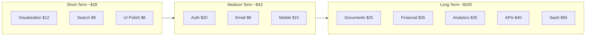

# Improvement Plan

This document outlines planned improvements, enhancements, and technical debt items for the Tenant Management System, with effort estimates in Claude agent time.

---

## Table of Contents

- [Current Status](#current-status)
- [Short-Term Improvements](#short-term-improvements)
- [Medium-Term Enhancements](#medium-term-enhancements)
- [Long-Term Vision](#long-term-vision)
- [Technical Debt](#technical-debt)
- [Implementation Roadmap](#implementation-roadmap)

---

## Current Status

**Version:** 1.1.0
**Release Date:** 2026-01-11
**Test Coverage:** 81.81%
**Linting Status:** Passing (black, ruff, pylint)
**Development Cost:** ~$87 (Claude API)

### Completed Features

- Multi-building tenant management (11, 13, 15, 17)
- Excel-based database with automatic backups
- MCP server with REST API (Tools, Resources, Prompts)
- React web UI with dashboard
- AI-powered report generation
- Family member tracking (WhatsApp, PalGate)
- Interactive building visualization
- Owner/renter workflow with owner info capture
- Tenant replacement flow with history preservation

---

## Short-Term Improvements

### Priority 1: Data Visualization Enhancements

**Goal:** Add charts and graphs to AI query responses

| Feature | Description | Claude Time | Est. Cost |
|---------|-------------|-------------|-----------|
| Occupancy charts | Bar charts showing occupancy by building | 30 min | $2-3 |
| Trend lines | Move-in/move-out trends over time | 30 min | $2-3 |
| Pie charts | Owner vs renter distribution | 20 min | $1-2 |
| Interactive graphs | Click to drill down into data | 1 hour | $5-8 |
| **Total** | | **~2.5 hours** | **~$12** |

**Implementation Approach:**
```python
# Add matplotlib/plotly integration to reporter
from src.ai_agent.visualizations import ChartGenerator

class ReportAgent:
    def generate_occupancy_report(self, building: int = None) -> ReportResult:
        # ... existing logic ...
        charts = self._chart_gen.create_occupancy_chart(data)
        return ReportResult(content=content, charts=charts)
```

### Priority 2: Search & Filter Enhancements

| Feature | Description | Claude Time | Est. Cost |
|---------|-------------|-------------|-----------|
| Advanced filters | Date range, status combinations | 30 min | $2-3 |
| Saved searches | Store frequent queries | 20 min | $1-2 |
| Export results | CSV/Excel export | 20 min | $1-2 |
| Pagination | Handle large result sets | 20 min | $1-2 |
| **Total** | | **~1.5 hours** | **~$8** |

### Priority 3: UI/UX Polish

| Feature | Description | Claude Time | Est. Cost |
|---------|-------------|-------------|-----------|
| Loading states | Better feedback during operations | 15 min | $1 |
| Error handling | User-friendly error messages | 20 min | $1-2 |
| Form validation | Real-time field validation | 20 min | $1-2 |
| Keyboard navigation | Accessibility improvements | 20 min | $1-2 |
| Dark mode | Theme toggle option | 30 min | $2-3 |
| **Total** | | **~2 hours** | **~$8** |

---

## Medium-Term Enhancements

### Authentication & Authorization

**Goal:** Add user management and role-based access control

| Phase | Description | Claude Time | Est. Cost |
|-------|-------------|-------------|-----------|
| User registration/login | Basic auth flow | 1 hour | $5-8 |
| Session management | JWT tokens | 45 min | $3-5 |
| Role definitions | Admin, Manager, Viewer | 30 min | $2-3 |
| Building-level permissions | Per-building access | 45 min | $3-5 |
| Audit logging | Track user actions | 30 min | $2-3 |
| **Total** | | **~3.5 hours** | **~$20** |

**Database Schema Addition:**
```
Users Table:
- user_id (UUID)
- email (unique)
- password_hash
- role (admin/manager/viewer)
- assigned_buildings (list)
- created_at
- last_login
```

### Email Notifications

| Notification | Trigger | Claude Time | Est. Cost |
|--------------|---------|-------------|-----------|
| New tenant welcome | Tenant registration | 20 min | $1-2 |
| Lease expiration reminder | 30 days before move-out | 20 min | $1-2 |
| Occupancy report | Weekly summary | 30 min | $2-3 |
| System alerts | Backup failures, errors | 20 min | $1-2 |
| **Total** | | **~1.5 hours** | **~$8** |

### Mobile Responsiveness

**Current State:** Functional but not optimized for mobile

| Improvement | Claude Time | Est. Cost |
|-------------|-------------|-----------|
| Responsive grid layout | 45 min | $3-5 |
| Touch-friendly controls | 30 min | $2-3 |
| Collapsible navigation | 20 min | $1-2 |
| Swipe gestures | 30 min | $2-3 |
| PWA support | 45 min | $3-5 |
| **Total** | **~2.5 hours** | **~$15** |

---

## Long-Term Vision

### Phase 2 Features

| Feature | Claude Time | Est. Cost |
|---------|-------------|-----------|
| Document Management | 3-4 hours | $20-30 |
| Financial Module | 4-5 hours | $25-40 |
| Maintenance Requests | 3-4 hours | $20-30 |

### Phase 3 Features

| Feature | Claude Time | Est. Cost |
|---------|-------------|-----------|
| Advanced Analytics | 4-5 hours | $25-40 |
| Integration APIs | 5-6 hours | $30-50 |
| Multi-Tenant SaaS | 8-10 hours | $50-80 |

---

## Technical Debt

### High Priority

| Item | Issue | Claude Time | Est. Cost |
|------|-------|-------------|-----------|
| Test coverage gaps | Some edge cases untested | 30 min | $2-3 |
| Error messages | Generic errors in some flows | 20 min | $1-2 |
| API rate limiting | No protection against abuse | 15 min | $1 |
| Input sanitization | Basic validation only | 20 min | $1-2 |
| **Total** | | **~1.5 hours** | **~$7** |

### Medium Priority

| Item | Issue | Claude Time | Est. Cost |
|------|-------|-------------|-----------|
| Excel file locking | Single-writer limitation | 1 hour | $5-8 |
| Backup rotation | Manual cleanup needed | 20 min | $1-2 |
| Logging verbosity | Inconsistent log levels | 15 min | $1 |
| Config validation | Runtime errors possible | 15 min | $1 |
| **Total** | | **~2 hours** | **~$10** |

### Low Priority

| Item | Issue | Claude Time | Est. Cost |
|------|-------|-------------|-----------|
| Code comments | Some complex logic undocumented | 20 min | $1-2 |
| Type hints | Incomplete in some modules | 30 min | $2-3 |
| Performance profiling | No baseline metrics | 20 min | $1-2 |
| **Total** | | **~1 hour** | **~$5** |

---

## Implementation Roadmap

### Estimated Costs by Phase



### Implementation Timeline (Claude Sessions)

| Phase | Features | Total Claude Time | Est. Cost |
|-------|----------|-------------------|-----------|
| Short-Term | Visualization, Search, UI | ~6 hours | ~$28 |
| Medium-Term | Auth, Email, Mobile | ~7.5 hours | ~$43 |
| Technical Debt | All items | ~4.5 hours | ~$22 |
| **Total v1.x** | | **~18 hours** | **~$93** |

### Comparison: Claude vs Traditional

| Phase | Claude Cost | Traditional Dev Cost |
|-------|-------------|---------------------|
| Short-Term | ~$28 | ~$2,000 |
| Medium-Term | ~$43 | ~$4,000 |
| Long-Term | ~$200 | ~$20,000 |
| **Total** | **~$271** | **~$26,000** |

---

## Success Metrics

### Improvement Tracking

| Metric | Current | Target | Claude Sessions |
|--------|---------|--------|-----------------|
| Test coverage | 81.81% | 90% | 2 sessions |
| Load time | 1.2s | <0.5s | 1 session |
| Mobile usability | 60% | 90% | 3 sessions |
| Error rate | 2% | <0.5% | 2 sessions |

### Feature Adoption

| Feature | Adoption Target | Sessions to Build |
|---------|-----------------|-------------------|
| AI reports | 80% of users | Already built |
| Dashboard | 100% of users | Already built |
| Visualizations | 70% of users | 2-3 sessions |

---

## Feedback & Suggestions

Submit improvement suggestions:
- GitHub Issues: [Repository Issues](https://github.com/yourusername/tenant-management/issues)
- Email: feedback@example.com

---

**Document Version:** 2.0.0
**Last Updated:** 2026-01-11
**Next Review:** 2026-02-11
