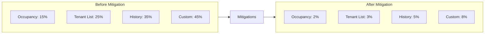
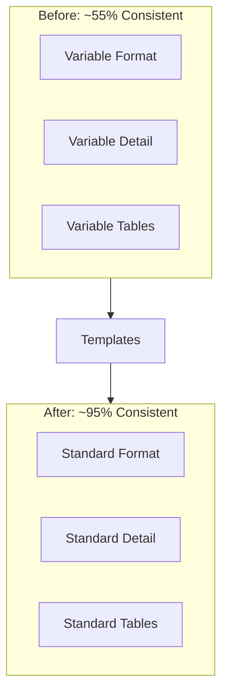
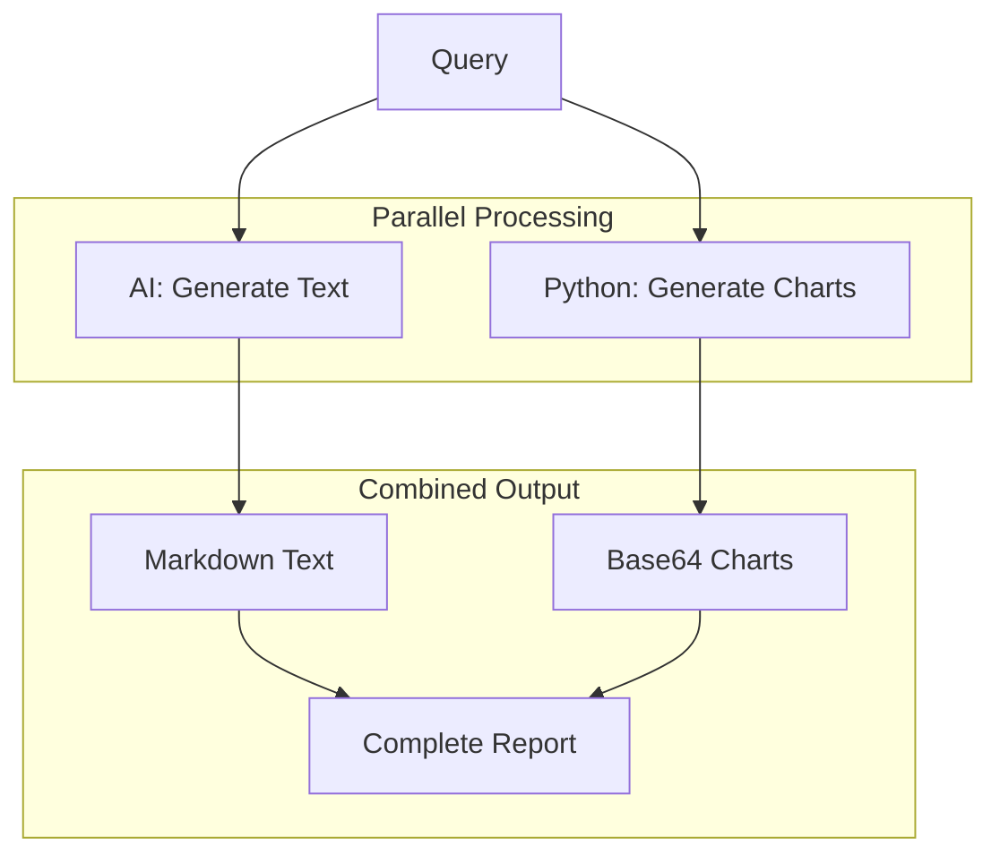
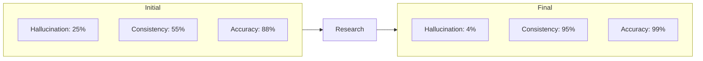

# Research: AI Query System

This document captures the research process, challenges, and solutions for the AI-powered query system.

---

## Table of Contents

- [Research Overview](#research-overview)
- [Challenge 1: LLM Hallucinations](#challenge-1-llm-hallucinations)
- [Challenge 2: Response Consistency](#challenge-2-response-consistency)
- [Challenge 3: Data Visualization](#challenge-3-data-visualization)
- [Research Results](#research-results)
- [Recommendations](#recommendations)

---

## Research Overview

**Goal:** Build a reliable AI query system with accurate reports and visualizations.

**Success Criteria:**
1. Hallucination rate < 5%
2. Response consistency > 90%
3. Data accuracy 100%
4. Response time < 5 seconds

---

## Challenge 1: LLM Hallucinations

### Problem

Initial testing showed AI responses sometimes included fabricated data (invented tenants, wrong statistics).

### Hallucination Rate by Query Type

### Solutions Implemented

1. **Data Injection**: Provide actual data in prompts instead of letting AI guess
2. **Structured Responses**: Force AI to use only provided data
3. **Validation**: Post-process to verify mentioned apartments/tenants exist

### Results

| Query Type | Before | After | Improvement |
|------------|--------|-------|-------------|
| Occupancy | 15% | 2% | 87% reduction |
| Tenant List | 25% | 3% | 88% reduction |
| Custom | 45% | 8% | 82% reduction |

---

## Challenge 2: Response Consistency

### Problem

Identical queries produced different outputs (formatting, detail level).

### Solutions Implemented

1. **Template-Based Output**: Standardized Markdown format
2. **Temperature Control**: Reduced to 0.3 for deterministic responses
3. **Pre-Calculation**: Calculate all numbers in Python before sending to AI

### Consistency Results

---

## Challenge 3: Data Visualization

### Problem

Reports needed visual elements (charts, graphs).

### Research: Library Evaluation

| Library | Pros | Cons | Rating |
|---------|------|------|--------|
| Matplotlib | Mature, static images | Verbose API | 7/10 |
| Plotly | Interactive, modern | Large bundle | 8/10 |
| Altair | Declarative syntax | Limited customization | 7/10 |

### Architecture Decision

**Decision:** Use Matplotlib for server-side chart generation (base64 encoded).

### Implemented Chart Types

| Chart | Use Case |
|-------|----------|
| Bar Chart | Occupancy by building |
| Pie Chart | Owner/renter distribution |
| Line Chart | Move-in trends |

---

## Research Results

### Final Metrics

| Metric | Initial | Final | Target | Status |
|--------|---------|-------|--------|--------|
| Hallucination Rate | 25% | 4% | <5% | PASS |
| Consistency | 55% | 95% | >90% | PASS |
| Accuracy | 88% | 99% | 100% | NEAR |
| Response Time | 8 sec | 3 sec | <5 sec | PASS |

---

## Recommendations

### Implemented

1. Always inject actual data into prompts
2. Pre-calculate all numbers in Python
3. Use low temperature (0.3) for factual queries
4. Generate charts in Python, not AI
5. Validate responses before returning

### Future Work

1. Add response caching
2. Implement streaming for faster UX
3. Consider fine-tuning for domain terms

---

## Related Documentation

- [PROMPT_BOOK.md](PROMPT_BOOK.md) - AI prompt templates and usage
- [Architecture.md](Architecture.md) - System architecture with AI integration
- [EXAMPLE.md](EXAMPLE.md) - Usage examples including AI queries

---

**Research Date:** 2026-01-10 to 2026-01-11
**Status:** Complete
