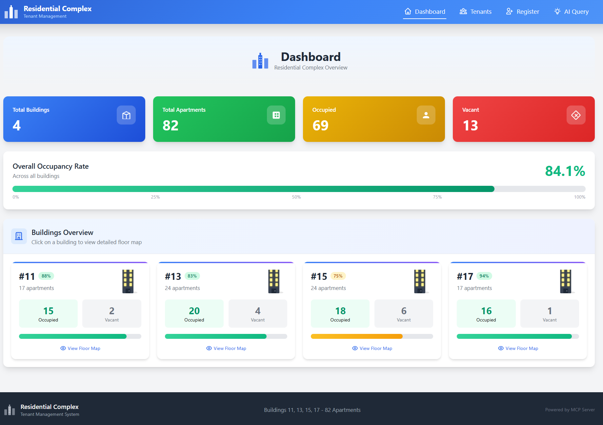
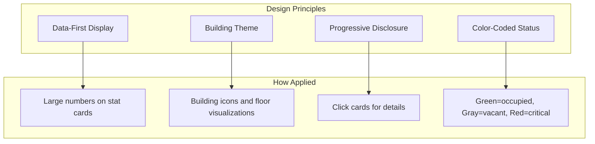
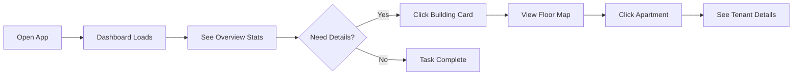
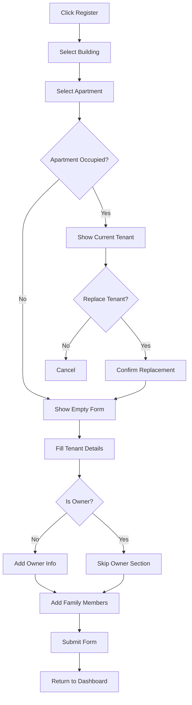
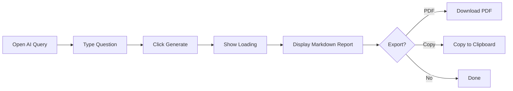
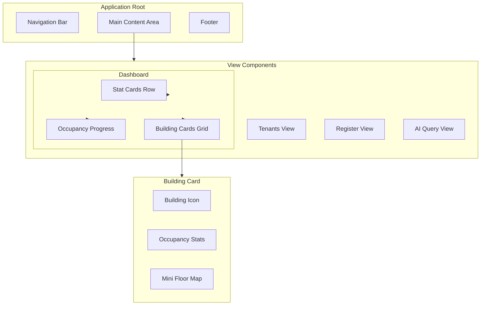
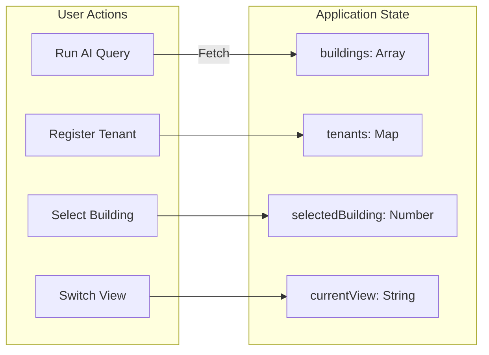
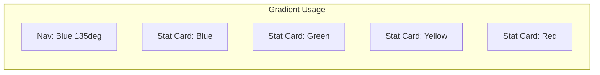
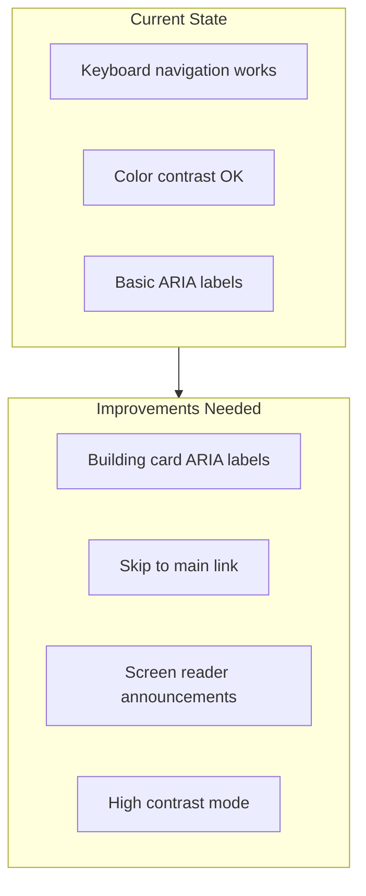
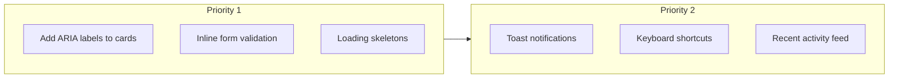

# UX/UI Analysis

This document provides analysis of the Tenant Management System's user interface, design decisions, and UX patterns.

---

## Table of Contents

- [Screenshots](#screenshots)
- [Design Philosophy](#design-philosophy)
- [User Flow Analysis](#user-flow-analysis)
- [Component Architecture](#component-architecture)
- [Design System](#design-system)
- [Accessibility](#accessibility)
- [Recommendations](#recommendations)

---

## Screenshots

### Dashboard Overview

**Key Elements Visible:**
1. **Navigation Bar** - Blue gradient with building icon, nav items (Dashboard, Tenants, Register, AI Query)
2. **Statistics Cards** - Four colored cards showing totals (Buildings: 4, Apartments: 82, Occupied: 69, Vacant: 13)
3. **Occupancy Progress Bar** - Full-width bar showing 84.1% occupancy rate
4. **Building Cards** - Four cards (#11, #13, #15, #17) with mini floor maps and occupancy counts

---

## Design Philosophy

### Core Principles

### Design Decisions and Rationale

| Decision | Rationale | Alternative Considered |
|----------|-----------|----------------------|
| Building-themed UI | Users manage physical buildings, visual metaphor aids understanding | Generic data table (rejected: less intuitive) |
| Color-coded cards | Instant status recognition without reading | Monochrome with text labels (rejected: slower comprehension) |
| Mini floor maps | Shows apartment layout at glance | Simple percentage text (rejected: loses spatial context) |
| Single-page app | Fast navigation, no page reloads | Multi-page with routing (rejected: unnecessary complexity) |

---

## User Flow Analysis

### Primary User Journey: View Building Status

### Secondary Flow: Register New Tenant

### AI Query Flow

---

## Component Architecture

### UI Component Hierarchy

### State Management

---

## Design System

### Color Palette

| Color | Hex | CSS Variable | Usage |
|-------|-----|--------------|-------|
| Primary Blue | #3b82f6 | `--color-primary` | Navigation, buttons, links |
| Success Green | #22c55e | `--color-success` | Occupied status, confirmations |
| Warning Yellow | #eab308 | `--color-warning` | Medium occupancy, alerts |
| Danger Red | #ef4444 | `--color-danger` | Low occupancy, errors |
| Background | #f3f4f6 | `--color-bg` | Page background |
| Card White | #ffffff | `--color-card` | Card backgrounds |

### Gradient Styles

**CSS Gradient Definitions:**
- Navigation: `linear-gradient(135deg, #1e40af, #3b82f6, #60a5fa)`
- Blue Card: `linear-gradient(135deg, #3b82f6, #1d4ed8)`
- Green Card: `linear-gradient(135deg, #22c55e, #16a34a)`

### Typography

| Element | Size | Weight | Font |
|---------|------|--------|------|
| H1 | 32px | 700 | System sans-serif |
| H2 | 24px | 600 | System sans-serif |
| Body | 16px | 400 | System sans-serif |
| Stat Number | 36px | 700 | System sans-serif |
| Caption | 14px | 400 | System sans-serif |

### Spacing Scale

| Token | Value | Usage |
|-------|-------|-------|
| xs | 4px | Inline elements |
| sm | 8px | Related items |
| md | 16px | Card padding |
| lg | 24px | Section gaps |
| xl | 32px | Page margins |

---

## Accessibility

### Current Implementation

| Feature | Status | Implementation |
|---------|--------|----------------|
| Keyboard Navigation | Partial | Tab through nav, forms work |
| Color Contrast | Good | All text meets WCAG AA (4.5:1) |
| Focus Indicators | Good | Blue outline on focus |
| Screen Reader | Basic | Buttons have labels |
| Responsive | Good | Grid adapts to screen size |

### Accessibility Flow

---

## Recommendations

### Short-Term Improvements

### Feature Roadmap

| Feature | Description | Complexity |
|---------|-------------|------------|
| Global Search | Search tenants from header | Medium |
| Bulk Actions | Select multiple apartments | Medium |
| Export Reports | Download tenant lists as CSV | Low |
| Dark Mode | Alternative color scheme | Medium |
| Mobile App | React Native version | High |

### UX Improvements

1. **Feedback Enhancement**
   - Toast notifications for actions (success/error)
   - Loading skeletons instead of spinners
   - Undo capability for tenant deletion

2. **Navigation Enhancement**
   - Breadcrumb trail for deep navigation
   - Recent items in sidebar
   - Quick-access keyboard shortcuts

3. **Form Enhancement**
   - Auto-save form drafts
   - Inline validation feedback
   - Smart defaults based on context

---

## Related Documentation

- [Architecture.md](Architecture.md) - Technical architecture and data flow
- [EXAMPLE.md](EXAMPLE.md) - Usage examples with screenshots
- [PRD.md](PRD.md) - Product requirements and specifications

---

**Document Version:** 2.0.0
**Last Updated:** 2026-01-11
